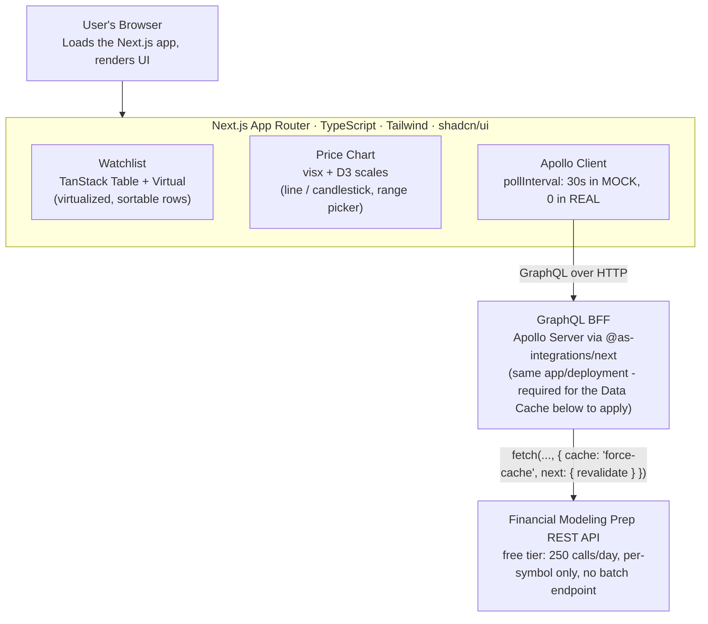

# TradeView Lite — Architecture

A stock watchlist dashboard: Next.js 16 (App Router) + TypeScript + Tailwind + shadcn/ui frontend, talking to a
self-hosted GraphQL BFF that wraps Financial Modeling Prep's REST API.

## System overview

Component base is shadcn/ui (Radix UI primitives + Tailwind) — the code lives in the repo (`src/components/ui/`),
not a black-box import.

## Frontend

- **Routes:** Dashboard (`/`), Markets (`/markets`), Settings (`/settings`) — shared sidebar shell (`src/components/app-sidebar.tsx`), three real App Router routes, not a single page.
- **Watchlist:** TanStack Table v9 + TanStack Virtual — virtualized, sortable grid (`src/components/watchlist/watchlist-table.tsx`).
- **Charts:** visx + D3 scales — line and candlestick views, with a date-range picker (1W/1M/3M/1Y). Candlesticks are MOCK-only (see below). Shared rendering (`PriceHistoryChart`, `CandlestickChart`) is reused across the main chart, the Markets/indices sparklines, and the expandable symbol-detail modal.
- **State:**
  - Local: React `useState`/`useReducer`.
  - Global + persistence: Zustand with the `persist` middleware — watchlist array, selected symbol, and data mode sync to `localStorage` automatically, one mechanism for both concerns (`src/lib/store/app-store.ts`).
  - Server/async: Apollo Client's own `useQuery` + `pollInterval`, with `errorPolicy: "all"` so a transient error doesn't discard already-loaded data.
  - Form: direct Zod validation (`tickerSchema.safeParse`) for the single-field add-ticker combobox — no React Hook Form for this one field.

## Data layer — GraphQL BFF

Apollo Server is mounted via `@as-integrations/next` as an App Router Route Handler (`src/app/api/graphql/route.ts`)
— the same Next.js app/deployment, not a separate function, which is what lets the `fetch` calls below actually use
Next's Data Cache.

- **Schema** (`src/lib/graphql/schema.ts`): `DataMode` (`MOCK`/`REAL`) and `HistoryRange` (`WEEK`/`MONTH`/`QUARTER`/`YEAR`) enums; `quotes`, `history`, `candles` (mock-only), and `news` (mock-only) queries.
- **Mock source** (`src/lib/data-source.ts`): deterministic pseudo-random walk, no network — simulates unknown-symbol and rate-limited states so the UI's error paths have something real to render against.
- **Real source** (`src/lib/real-data-source.ts`): Financial Modeling Prep REST API, one call per symbol (the free tier has no batch-quote endpoint). Each fetch uses `cache: "force-cache"` + `next: { revalidate }` (120s for quotes, 3600s for history) and an 8s timeout (`AbortSignal.timeout`). Per-symbol errors map cleanly: HTTP 402 → `UNKNOWN_SYMBOL`, 429 → `RATE_LIMITED` (stale flag set), network/timeout → `FETCH_FAILED`.

## Two data modes

- **MOCK** (default everywhere): free, local, polls every 30s for a live-feeling demo.
- **REAL**: Financial Modeling Prep, free tier (250 calls/day). Client-side polling is disabled entirely in REAL mode — it fetches once per toggle or watchlist change instead of continuously, since there's no batch endpoint to amortize the cost of N tracked symbols. The indices strip and candlestick charts stay MOCK-only regardless of the toggle: FMP's free tier doesn't serve the plain index tickers this app uses internally, and its `historical-price-eod/light` endpoint has no OHLC data to build real candles from.

## Testing & CI

- **Unit** (`bun test`): ticker validation, the Zustand store's actions, and both data sources (the real one with `fetch` mocked).
- **e2e** (`@playwright/test`): dashboard, watchlist, Markets, and Settings flows — MOCK mode only, since REAL mode needs a live FMP key that's never committed.
- **Accessibility**: an axe-core audit runs as part of the e2e suite against every route, on every CI run.
- **CI** (`.github/workflows/ci.yml`, GitHub Actions): lint → unit tests → build → e2e + accessibility audit → `bun audit` (dependency vulnerabilities), one sequential job.

## Known scope limits

- No auth/user accounts, no database — Zustand + `localStorage` persistence only.
- No i18n.
- No SSR/RSC data-fetching pattern — GraphQL is fetched entirely client-side via Apollo from `"use client"` components, even though the app runs on Next.js.
- REAL mode has no CI coverage (by design — no FMP key is ever committed).
- Not yet deployed — lives as source + CI only.
