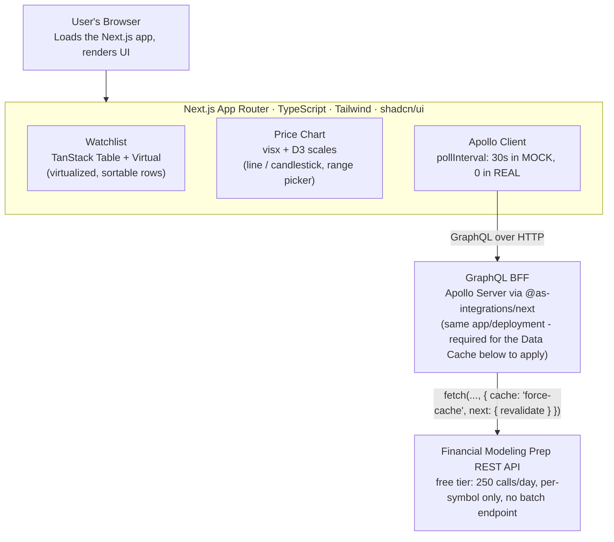

# TradeView Lite — Architecture

Personal project exploring newer Next.js/GraphQL tooling versions, extending real financial-dashboard experience from a fintech job. Repo: [github.com/meenakshi-ojha/tradeview-lite](https://github.com/meenakshi-ojha/tradeview-lite)

## System overview

Component base is shadcn/ui (Radix UI primitives + Tailwind) — the code lives in the repo (`src/components/ui/`), not a black-box import.

**Deploy:** not yet deployed — lives as source on GitHub only (see the CI/testing gaps noted in Round 9).

## Round 9 — a real test suite and CI pipeline, replacing zero tests

- **Biggest gap of the whole project going into this round: no committed tests.** Every prior verification in this build's history was an ad-hoc Playwright script run once in a scratch directory, never checked in — real for one run, invisible to anyone after. Closed with 29 `bun test` unit tests (ticker validation, the Zustand store's actions, both mock and real data sources) and 13 `@playwright/test` e2e specs covering the dashboard, watchlist, Markets, and Settings.
- **The e2e suite found two real, previously-unnoticed accessibility bugs** via an axe-core audit wired into the suite itself (not a separate manual step): the "remove" column's sort-header rendered a fully empty, focusable `<button></button>` (its header label was a literal empty string), and the "Add ticker" combobox button's `role="combobox"` broke its accessible-name computation despite having visible text — both are "critical"/"serious" impact per axe, not nitpicks. Fixed both; the axe check now runs against every route on every CI run as a regression guard.
- **The same audit caught a genuine contrast failure this project's own earlier contrast-fixing round had missed:** the destructive `Badge` variant (used for "Rate limited"/"Unknown symbol" labels) measured 4.01:1 against its own background — axe flagged it directly, not a guess. Fixed the same way the change% text was fixed earlier: swapped to `text-red-700`/`dark:text-red-400`, computed at 5.44:1 against the actual badge background before shipping it.
- **Two of my own early test failures were test-script bugs, not app bugs** — worth noting because a test suite has to be trusted, and blindly "fixing the app until the test passes" would have been wrong here: `getByRole("button", ...)` couldn't find the Add-ticker control because its explicit `role="combobox"` makes its computed ARIA role `combobox`, not `button` — the locator itself was wrong, not the app.
- **Testing strategy is split deliberately by what's actually testable without a live network dependency:** unit tests cover pure logic (including `real-data-source.ts` with `globalThis.fetch` mocked — the exact 402/429/network-error/field-rename paths this project already got wrong once for real), e2e covers UI flows, both exclusively in MOCK mode. REAL mode is deliberately untested in CI: it needs a live FMP key that's never committed, and even mocked-network unit coverage of the error-mapping logic already protects the behavior that matters.
- **Zustand testing gotcha, worth documenting:** `useAppStore.setState(data, true)` (the "replace" flag) replaces the *entire* state object — including the action functions living on that same object — not just the data fields. A merge-style `setState(data)` (no replace flag) is what resets test state without deleting the store's own methods.
- **Zustand's persist middleware assumes `window.localStorage` specifically**, not a bare `localStorage` global — a Bun/Node test environment has neither by default. A small preloaded polyfill (`bunfig.toml` → `test-setup.ts`) supplies both.
- **CI pipeline (GitHub Actions):** install → lint → unit tests → build (Next's own typecheck runs here) → Playwright e2e + axe audit → `bun audit` for dependency vulnerabilities. One job, sequential, so the build artifact is produced once and reused by the e2e step's `bun run start` rather than building twice.
- **Deferred, not forgotten:** i18n and an SSR/RSC data-fetching pattern (this app fetches GraphQL entirely client-side from `"use client"` components, even though it runs on Next.js) are real gaps identified alongside this one, but both are substantially larger, separate efforts — noted here rather than attempted as a rushed add-on to a testing/CI pass.

## Round 8 — external code review, and the caching claim was actually false

- **A single failed poll was blanking the whole watchlist:** `useQuery` had no `errorPolicy`, so Apollo's default (`"none"`) set `data` to `undefined` on any transient GraphQL error, and the component treated that as "nothing to show" — a dropped 30s poll replaced a populated table with a full error card. Fixed with `errorPolicy: "all"` (keeps last-good data alongside the error) and changed the guard to only hard-fail when there's truly nothing cached (`error && quotes.length === 0`); otherwise the table stays up with a small "couldn't refresh" banner.
- **The Round 3/7 caching claim was never actually true — verified, not assumed:** this exact Next.js build's own bundled docs (`node_modules/next/dist/docs/.../fetch.md`) state plainly: "Caching is opt-in. Set `cache: 'force-cache'` to cache any request, including POST." Neither FMP fetch call set it — only `next: { revalidate }`, which does nothing without `cache: "force-cache"` alongside it. Every REAL-mode request had been hitting FMP fresh this whole time, Round 3's "runs inside a Route Handler so the Data Cache applies" reasoning notwithstanding.
- **Fixed and proven with real numbers, not just "should work now":** added `cache: "force-cache"` to both fetch calls, then measured actual latency around each call. Three identical GraphQL requests for AAPL in REAL mode: **1109ms, 1ms, 0ms** — the first a genuine FMP round-trip, the next two served from the Next.js Data Cache. A different symbol (MSFT) in the same window measured **1075ms**, confirming the cache key is scoped per-symbol, not accidentally global.
- **Quote revalidate widened to 120s** (from 60s) now that it's genuinely caching — with REAL mode's client polling already disabled, a longer window only adds staleness that's invisible anyway without polling to reveal it.
- **Freshness became visible, not just theoretical:** queried `updatedAt` on every quote since early on but never rendered it, while the dashboard subtitle hardcoded "updated every 30 seconds" — untrue in REAL mode. Added a live "Updated Xs ago" readout above the watchlist (ticks every second) and made the subtitle mode-aware.
- **Checked index symbols against the live API too:** the plain `SPX`/`NDX`/`DJI` this app uses internally 402 on FMP's free tier, but the real caret-prefixed tickers (`^GSPC`/`^IXIC`/`^DJI`) actually work. Left as-is (indices already hardcoded to MOCK mode, independent of the toggle, per Round 6) rather than rewiring the internal symbol scheme — noted here as a viable future path, not implemented now, since it was the lowest-priority item from the review.
- **Used real semantic HTML, reviewed mid-build:** several click targets (index cards, market cards, news rows) were `
` — a hand-rolled re-implementation of what a real `<button>` (or shadcn's `Button`) already provides for free. Replaced with the actual `Button` component throughout. Where a card also has a nested "Add" button (Markets), only the open-chart region got one — a button can't legally nest inside another button, so Add stayed a sibling action, not a wrapper.
- **Follow-up catch, also verified rather than assumed:** does `cache: "force-cache"` also pin a transient failure (a 429/402) for the full revalidate window, turning a 1-second upstream hiccup into 2 minutes of stale-out? The bundled docs answer directly — "Only responses with a `200` HTTP status code are stored" — so non-200 responses are excluded from the Data Cache at the framework level, not by anything this project's code does. Confirmed empirically, not just by the doc: three requests for a guaranteed-402 symbol measured 1037ms / 229ms / 236ms — nowhere near the 0-2ms signature a real cache hit showed in the Round 8 measurement, just a warm TCP/TLS connection making the retry faster. No patch needed.

## Round 7 — REAL mode tested against the live API, not just in theory

- **The batch-quote assumption from Round 5 was wrong:** tested directly against the live FMP API and `batch-quote` returns HTTP 402 ("not available under your current subscription") on the free tier — it's paid-plan-only. This was the actual cause of every REAL-mode toggle failing with a fetch error. The free tier only has single-symbol `/stable/quote?symbol=X`.
- **FMP's free tier returns 402 for an unserviceable symbol too**, not 404 or an empty array — verified against a deliberately-fake ticker. A per-symbol 402 is now mapped to `UNKNOWN_SYMBOL` rather than treated as a fatal error.
- **No batch endpoint means N symbols = N provider calls per fetch**, which breaks the original "40 calls/min headroom" math from Round 3 — that math assumed one call per poll, not one call per symbol per poll. Fix: the Data Cache window widened to 60s, and REAL mode's client-side `pollInterval` is disabled entirely (0, not 30000) across the watchlist table, stats bar, and Markets grid. REAL mode now fetches once per toggle/watchlist-change instead of continuously polling — the quota can't be burned by just leaving the tab open.
- **Verified end-to-end, not just unit-tested:** curled the live FMP endpoints directly to confirm the 402s, then toggled REAL mode through the actual running UI (Playwright) and confirmed real AAPL/MSFT/NVDA prices and a real price-history chart render with zero console errors — not just "the code looks right."

## State management (final)

- **Local:** React `useState`/`useReducer` — native, no library.
- **Global + persistence, unified:** Zustand with the `persist` middleware. Watchlist symbol array and selected ticker sync to localStorage automatically — one mechanism, not a hand-rolled sync layer. This is the clean answer to "how does state survive a refresh."
- **Server/async:** Apollo Client's own `useQuery` + `pollInterval` — no separate TanStack Query layer (would be redundant with Apollo). TanStack Table/Virtual stays distinct — that's the grid, not the data layer, no conflict.
- **Form:** direct Zod validation (`tickerSchema.safeParse`) for the add-ticker combobox — React Hook Form was deliberately dropped for this one field (see Round 6). Sync format validation (uppercase ticker regex) + duplicate-add guard, framed explicitly as rate-budget protection, not just polish — an invalid symbol added without a guard gets refetched every poll for nothing.

## Round 6 — UI feedback after first look: full-width layout, combobox, more visual substance

- **Add-ticker input became a searchable combobox** (shadcn Command + Popover), not a blind free-text field — suggests from the known symbol universe, still falls back to free entry for anything else. Direct feedback: a text box for picking a known ticker is worse UX than a dropdown.
- **React Hook Form dropped from this one field, on purpose:** a single-field combobox doesn't benefit from RHF's multi-field state orchestration — direct Zod validation covers the same format-check + rate-budget-protection goal with less machinery. This is a reasoned deviation from the original "Form: RHF + Zod" plan, not a silent drift — matching the tool to the actual problem beats forcing the originally-planned library in everywhere.
- **Layout went full-width** with a real dashboard shell (header bar, stats row, wider grid) instead of a centered `max-w-5xl` column — the original layout read as sparse on a real monitor.

## Round 5 — real provider confirmed as FMP

- **Provider is Financial Modeling Prep (FMP)**, not Finnhub (the original planning assumption) — free tier: 250 calls/day, 512MB bandwidth/30 days (a daily quota, not per-minute). Mock-by-default matters even more here: this budget is small enough that dev/demo iteration alone could burn it if REAL mode were ever the default.
- **Two-mode toggle added:** `quotes(symbols, mode: MOCK|REAL)` and `history(symbol, mode: MOCK|REAL)` in the GraphQL schema itself, default MOCK. Zustand store holds the current mode; a UI toggle switches it. Explicit, inspectable, no hidden env-var-only switch.
- **REAL mode error handling:** a 429 from FMP returns stale + a "rate limited" flag rather than throwing (matches the Core #6 error-state design); an unconfigured key or fetch failure degrades to a clean per-symbol error rather than crashing the query.

## Round 4 — feature list refined after third cross-check

- **Error/empty/loading/rate-limited states promoted to Core:** for a financial dashboard this is the most obvious thing to probe, and it's nearly free since Apollo already surfaces `loading`/`error` per query. Covers: empty watchlist, a failed poll, a provider 429 (show stale data + a "rate limited" badge rather than a hard error), and an invalid symbol.
- **Accessibility freebie:** flash-on-change animation respects `prefers-reduced-motion` — cheap, and most of the a11y story comes free via Radix (shadcn/ui's foundation) anyway.

## Round 3 — resolved after second cross-check

- **Off the boundary:** the original 20 tickers/20s TTL point sat at exactly 60/60 calls per minute — zero headroom for the historical-data burst on first load, a second tab, or a stray manual refetch. Moved to **20 tickers/30s TTL = 40 calls/min**, leaving genuine headroom.
- **Data Cache only works inside Next's request lifecycle:** `fetch(url, { next: { revalidate } })` is silently ignored if Apollo Server runs as a standalone handler outside Next.js. Fixed by mounting Apollo via `@as-integrations/next` as an App Router Route Handler — same Next.js app, same deployment, resolvers execute in-request so the cache option actually applies.
- **Verification, not just theory:** log provider call counts once built and confirm they stay bounded under normal polling. One counter closes the loop on whether the caching claim is real (later revisited for real in Round 8, since the original version of this check turned out to be insufficient).
- **Terminology fixed:** "Next.js Data Cache, persisted across invocations" — not "edge-backed" or CDN caching, which is a different mechanism.

## Round 2 — resolved after first cross-check

- **Rate-limit math made explicit:** the original provider assumption was a per-symbol REST call with no multi-ticker batch endpoint. Real constraint is T tickers × (60 / R-second TTL) ≤ 60 calls/min. A DataLoader alone wouldn't fix this (it dedupes within one request, not across time); the TTL cache is what actually bounds the rate.
- **Separate TTLs:** live quotes cached ~30s, historical/chart data cached on the order of hours — intraday history barely changes, no reason to refetch it every poll.
- **SSR framing corrected:** "SSR shell + CSR live data," not "SSR gap closed" outright. Server Components render the static shell/layout; Apollo Client + polling handles live quote fetching client-side. Keeping this framing accurate matters more than it sounds — it's the kind of detail that falls apart under a follow-up question otherwise.
- **API key:** the provider key is a server-only env var, used only inside the BFF resolver, never exposed as `NEXT_PUBLIC_*`.

## Deliberate design decisions

- **BFF pattern, self-hosted:** builds its own thin GraphQL server wrapping a REST source, rather than consuming a public GraphQL API — demonstrates building and consuming GraphQL, not just consuming.
- **Polling instead of WebSocket/SSE:** chosen for free-tier rate-limit friendliness and simplicity, not because it's the objectively best choice — a personal project with modest real-time needs doesn't justify the added cost/complexity of sockets.
- **Apollo Client kept despite bundle weight:** a lighter fetch+SWR approach would be leaner for a single-user app with no real normalized-cache need, but the whole point of this project is working with Apollo/GraphQL client patterns directly — that trade-off is intentional.
- **shadcn/ui over Material UI/Mantine:** already has production MUI/Mantine experience elsewhere. shadcn/ui (Radix + Tailwind, code lives in-repo) is the newer pattern worth exploring instead of repeating existing experience.
- **Next.js App Router:** chosen to work directly with its SSR/rendering-strategy model rather than treat it as a black box — see the corrected "SSR shell + CSR live data" framing above.
- **FMP over alternatives:** landed on Financial Modeling Prep after the original Finnhub assumption (see Round 5) — reasonable free-tier limits, with the batch-vs-per-symbol reality only discovered by testing directly against the live API (Round 7).

## Feature list (final)

- **Core 1 — Watchlist table:** virtualized, sortable list of tracked tickers (symbol, price, change $/%), live-updating via polling. TanStack Table + Virtual.
- **Core 2 — Add/remove ticker:** combobox with Zod format validation + duplicate-add guard, framed as rate-budget protection.
- **Core 3 — Ticker detail + price chart:** click a row (Zustand holds the selection) → visx price history chart for that symbol, with a date-range picker and a line/candlestick toggle.
- **Core 4 — Live polling with visible freshness:** 30s `pollInterval` in MOCK mode, a "last updated" indicator, flash-on-change respecting `prefers-reduced-motion`.
- **Core 5 — Persisted watchlist:** Zustand `persist` middleware → localStorage, no database.
- **Core 6 — Error/empty/loading/rate-limited states:** empty watchlist, failed poll, provider 429 (stale data + "rate limited" badge, not a hard error), invalid symbol.
- **Stretch 7 — Table sorting:** by price change %, alphabetical, etc.
- **Stretch 8 — Markets browse page + indices strip + news panel:** added after the original planning list, alongside a sidebar-based multi-route shell (Dashboard/Markets/Settings).
- **Stretch 9 — Real tests:** done as of Round 9 — see above, not just a stretch goal anymore.

## Known scope limits (by design)

- No auth/user accounts — single-user demo.
- No database — Zustand + localStorage persistence only.
- No i18n, no SSR/RSC data-fetching pattern (see Round 9's "deferred, not forgotten" note) — both real gaps, both larger separate efforts.
